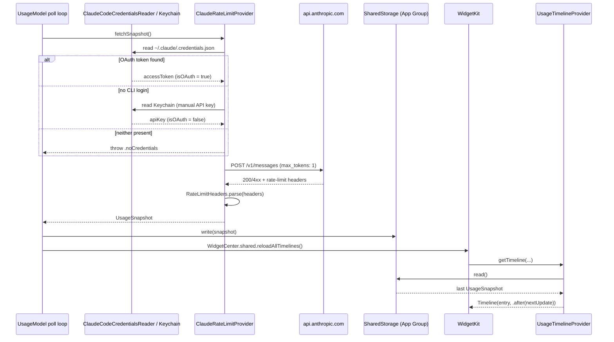

# ClaudeGauge Architecture

This document is for contributors who want to understand *why* the code is shaped the way it is, not just what it does. It covers the target split, the full request-to-pixel data flow, the sandboxing/entitlements model, the shared-UI pattern, credential resolution, and the local transcript parser.

> ClaudeGauge is an unofficial, independent, community project. It is **not affiliated with, endorsed by, or a product of Anthropic**.

## 1. The three-target structure

ClaudeGauge is built from three Xcode/SwiftPM targets, defined in `project.yml` (the XcodeGen spec — the `.xcodeproj` is generated from it and is not committed):

```
ClaudeGauge/
  ClaudeGauge/            → app target        (type: application)
  ClaudeGaugeWidget/      → widget extension   (type: app-extension)
  ClaudeGaugeCore/        → local Swift package (framework-free of SwiftUI)
  Shared/                 → plain source files compiled into BOTH app + widget
```

**`ClaudeGauge`** (the app target) is a `MenuBarExtra`-based SwiftUI app (`ClaudeGaugeApp.swift`). It's the only thing that ever talks to the network, owns the poll loop (`UsageModel`), renders the popover (`MenuBarView`, `MenuBarLabel`), and hosts settings (`SettingsView`). `LSUIElement = YES`, so it never shows a Dock icon.

**`ClaudeGaugeWidget`** is a WidgetKit app-extension target. It contains a `TimelineProvider` (`UsageTimelineProvider` in `ClaudeGaugeWidget.swift`) and small/medium widget layouts (`WidgetViews.swift`). It has no network code at all — see §2.

**`ClaudeGaugeCore`** is a local Swift package (`ClaudeGaugeCore/Package.swift`), deliberately built on plain `Foundation` with **no SwiftUI import anywhere in it**. It holds every piece of logic that has a right or wrong answer: credential resolution, header parsing, the shared-storage read/write contract, the Keychain wrapper, and the JSONL transcript parser. Both the app and widget targets depend on it as a package (`project.yml`'s `packages:` block), so there is exactly one copy of this logic, not two.

### Why split it this way

- **Testability.** `ClaudeGaugeCore` has zero UIKit/SwiftUI/WidgetKit dependencies, so `cd ClaudeGaugeCore && swift test` runs in well under a second, needs no simulator, no network, and no signing — it's the part of the codebase that's actually safe to iterate on quickly and run in CI. The 28 XCTest cases in `ClaudeGaugeCore/Tests/ClaudeGaugeCoreTests` cover both rate-limit header shapes (see §2, step 4), both credential-file schemas, JSONL parsing, `UsageSnapshot`'s label/status derivation, and `SharedStorage` round-tripping, entirely against synthetic data.
- **The widget and the app must share logic without duplicating it.** WidgetKit extensions are separate processes from the host app, with their own binary and their own execution budget. If `ClaudeRateLimitProvider` or `RateLimitHeaders.parse` lived only in the app target, the widget would either need a second network stack (defeating the "widget never touches the network" design in §2) or a copy-pasted parser that would silently drift out of sync the first time one of the two got a bugfix. Putting that logic in a package both targets link means there is one implementation, one set of tests, and one place to fix a bug.
- **`UsageProvider` is a protocol, not a concrete type**, specifically so that `ClaudeRateLimitProvider` is a *conformance*, not the whole story — see `ClaudeGaugeCore/Sources/ClaudeGaugeCore/UsageProvider.swift`. A future Codex/Gemini provider is new code, not a rewrite of every screen that consumes usage data (see [ROADMAP.md](ROADMAP.md)).

## 2. Data flow: timer tick to rendered widget

The rule that shapes this whole section: **the app fetches, the widget only ever reads.** No code path in `ClaudeGaugeWidget` ever calls `URLSession`.



Step by step, with the actual files involved:

1. **Timer tick.** `UsageModel` (`ClaudeGauge/UsageModel.swift`) is a `@MainActor` `ObservableObject` that owns a `Task` poll loop started from `init()` and restarted by `startPolling`. The interval is user-configurable — 1, 5, 10, 15, or 30 minutes, exposed via `SettingsView` — and stored in `UserDefaults.standard` (`refreshIntervalMinutes` key) as well as mirrored into the App Group via `SharedStorage.writeRefreshInterval`, so the widget's `TimelineProvider` can schedule its own next update in step with the app instead of guessing at a fixed cadence.

2. **Credential resolution** happens inside `ClaudeRateLimitProvider.fetchSnapshot()` (`ClaudeGaugeCore/Sources/ClaudeGaugeCore/ClaudeRateLimitProvider.swift`) on every call, not cached at init — see §4 for the exact priority order.

3. **The minimal request.** The provider issues exactly one `POST https://api.anthropic.com/v1/messages` with:
   ```json
   { "model": "claude-haiku-4-5-20251001", "max_tokens": 1, "messages": [{"role": "user", "content": "."}] }
   ```
   This is the cheapest real request the API accepts — one token of output, one word of input. The `Authorization: Bearer <token>` header is used for an OAuth token from the Claude Code CLI; `x-api-key: <token>` is used for a manually-entered API key. Anthropic-version is pinned (`anthropic-version: 2023-06-01`).

4. **Why headers, not the response body.** ClaudeGauge never inspects the completion — it discards the body's content entirely. What it reads are response headers Anthropic attaches to every authenticated `/v1/messages` call, and there are genuinely two different shapes depending on how the request was authenticated:
   - **Subscription (Claude Code OAuth token)**, a Pro/Max/Team plan's rolling 5-hour/weekly windows, reported as a ready-made utilization ratio:
     - `anthropic-ratelimit-unified-5h-utilization`, `anthropic-ratelimit-unified-weekly-utilization`
     - `anthropic-ratelimit-unified-5h-remaining`, `anthropic-ratelimit-unified-weekly-remaining` (seconds to reset)
   - **Pay-as-you-go Console API key**, which has no 5-hour/weekly session concept at all — instead it reports classic per-minute limits as (limit, remaining) pairs that have to be turned into a percentage:
     - `anthropic-ratelimit-tokens-limit` / `-remaining` / `-reset` (an ISO-8601 timestamp, not seconds)
     - `anthropic-ratelimit-requests-limit` / `-remaining` / `-reset`

   Treating a manually-entered API key as if it would produce the first shape is a real bug an earlier version of this file had: a pay-as-you-go key never reports `anthropic-ratelimit-unified-*` headers, so that code path always failed with "Anthropic didn't return usage headers for this account." `RateLimitHeaders.parse(_:)` (`ClaudeGaugeCore/Sources/ClaudeGaugeCore/RateLimitHeaders.swift`) tries the subscription shape first and falls back to the classic shape, returning a `ParsedRateLimits.kind` (`.unifiedSubscription` or `.classicAPIKey`) alongside the two percentages so the caller knows which one it got — lower-cased header lookup, values clamped and converted to whole-percent, remaining-seconds/timestamps converted to whole minutes, with no networking code in that file at all, which is what makes it trivially unit-testable.

   **Why this approach, and not the alternatives:**
   - *Cookie scraping* — reading a `claude.ai` session cookie out of the user's browser profile, which at least one competing tracker does — reads credentials the user never issued to this app, from a surface Anthropic doesn't document as an integration point. Its own maintainers note it "may violate Anthropic's Terms of Service." ClaudeGauge doesn't touch browser storage at all.
   - *A hypothetical official "usage API"* — there is no public REST endpoint for a consumer Claude Pro/Max/Team plan to query "how much of my session/weekly limit have I used." The rate-limit headers are the only documented, first-party signal available for that data on these plans.
   - *Reading the headers on a real request* is what Claude Code itself already does to warn users about limits — reusing that same signal, through the same OAuth token, using an official, documented header set, is not scraping and carries no ToS ambiguity. The `max_tokens: 1` request exists solely to get an authenticated response back cheaply; ClaudeGauge has no use for, and does not persist, the completion it returns.

5. **`UsageSnapshot` construction.** The parsed percentages/reset times are wrapped into a `UsageSnapshot` (`ClaudeGaugeCore/Sources/ClaudeGaugeCore/UsageSnapshot.swift`) — `sessionPercent`, `weeklyPercent`, optional `sessionResetMinutes`/`weeklyResetMinutes`, `fetchedAt`, a `source` tag (`.claudeCodeOAuth`, `.manualAPIKey`, or `.none`) recording which credential path produced it, and a `kind` tag (`.unifiedSubscription` or `.classicAPIKey`, carried through from `ParsedRateLimits.kind`) recording which header shape it was parsed from. The UI never hardcodes "Session"/"Weekly" as captions — it reads `snapshot.primaryLabel`/`snapshot.secondaryLabel`, which resolve to `"Session"`/`"Weekly"` for `.unifiedSubscription` and `"Tokens"`/`"Requests"` for `.classicAPIKey`, so the same two-gauge layout (`MenuBarView`, `ClaudeGaugeWidgetView`) is correct regardless of which credential path produced the data. `UsageSnapshot.status` derives a traffic-light `UsageStatus` (`.ok` / `.warning` / `.critical`) from `max(sessionPercent, weeklyPercent)`, independent of `kind`.

6. **The App Group hand-off.** Back in `UsageModel.fetch()`, a successful snapshot is assigned to the `@Published var snapshot` (driving the popover UI immediately) and written to `SharedStorage` (`ClaudeGaugeCore/Sources/ClaudeGaugeCore/SharedStorage.swift`), which is a thin wrapper over `UserDefaults(suiteName: "group.dev.claudegauge.shared")` — the App Group container both the app and the widget extension are entitled to. `SharedStorage.write` JSON-encodes the snapshot (ISO-8601 dates) under a single `usageSnapshot` key. Immediately after, `UsageModel` calls `WidgetCenter.shared.reloadAllTimelines()` to tell WidgetKit a new snapshot is available.

7. **The widget reads, never fetches.** `UsageTimelineProvider` (`ClaudeGaugeWidget/ClaudeGaugeWidget.swift`) implements WidgetKit's `TimelineProvider` with `placeholder`, `getSnapshot`, and `getTimeline` — every one of them calls `SharedStorage().read()` and nothing else. `getTimeline` also reads the app-set refresh interval back out of `SharedStorage` (falling back to 300s / 5 minutes) to pick a sensible `Timeline(... policy: .after(nextUpdate))`, so the widget's own refresh requests stay roughly in step with how often the app is actually producing new data — but even if WidgetKit calls it early or late, it can only ever render the last value the app wrote. This is deliberate: it keeps the extension inside WidgetKit's tight background-execution budget, and it makes "the widget shows a different number than the menu bar" structurally impossible — there is only one writer.

## 3. Signing and sandboxing model

macOS enforces an asymmetry here that shapes the entitlements directly:

| | `ClaudeGauge` (app) | `ClaudeGaugeWidget` (extension) |
|---|---|---|
| App Sandbox | **Off** | **On** (`com.apple.security.app-sandbox = true`) — OS requirement for all app extensions, not a ClaudeGauge choice |
| App Group | `group.dev.claudegauge.shared` | `group.dev.claudegauge.shared` |
| Hardened Runtime | On | On |

**Why the host app is unsandboxed.** `TranscriptLogParser` needs to walk `~/.claude/projects/**/*.jsonl`, and `ClaudeRateLimitProvider` needs to read the legacy `~/.claude/.credentials.json` file as a fallback when the primary Keychain-based credential lookup finds nothing (see §4) — both arbitrary paths under the user's home directory that the app was never handed through an `NSOpenPanel` or other user-driven file picker. A sandboxed process can only read paths it was explicitly granted (via `com.apple.security.files.user-selected.read-only`-style entitlements plus an actual picker interaction, or a security-scoped bookmark from a prior picker). There is no sandbox entitlement that grants blanket read access to "anything under `~/.claude/`" without the user manually pointing a file picker at it every session — which would make silent, timer-driven background polling impossible. So `ClaudeGauge.entitlements` carries only the App Group capability and no `app-sandbox` key at all, and free-form `FileManager`/`Data(contentsOf:)` calls in `ClaudeCodeCredentialsReader` and `TranscriptLogParser` work exactly as they would in any other unsandboxed macOS process.

**Why the widget extension must be sandboxed.** This isn't a ClaudeGauge design choice — WidgetKit (like every macOS/iOS app-extension point) requires `com.apple.security.app-sandbox = true` on the extension target as a condition of being loadable at all; an unsandboxed widget extension simply won't run. `ClaudeGaugeWidget.entitlements` reflects that.

**How the App Group bridges the asymmetry.** Both entitlement files list the same `com.apple.security.application-groups` value, `group.dev.claudegauge.shared`. That's the one exception the sandbox grants: a sandboxed process *can* read/write a `UserDefaults(suiteName:)` store and files under the shared App Group container, without a picker, as long as it holds that specific entitlement — because the group container is scoped to processes signed with a matching App Group, not to arbitrary paths. So the sandboxed widget can freely call `SharedStorage().read()` even though it could never call `ClaudeCodeCredentialsReader.read()` or `TranscriptLogParser.dailyUsage()` itself (and, by design, it never tries to — those calls live only in code paths the app target exercises). The unsandboxed app is the only process with free-form disk access; the App Group is the only channel the sandboxed extension has out to that data, and it's a read-only, app-mediated channel by construction, not by sandbox restriction alone.

## 4. Credential resolution and fallback

`ClaudeRateLimitProvider.fetchSnapshot()` resolves credentials fresh on every call, in this order:

1. **The Claude Code CLI's own OAuth login**, read by `ClaudeCodeCredentialsReader.read(from:keychainService:)`, which itself tries two places — because where Claude Code stores this has changed across versions, and an earlier version of this reader that only checked the file reported "no credentials found" for anyone on a current Claude Code install, even though they *were* logged in:
   - **Primary: the macOS Keychain**, service name `"Claude Code-credentials"` — where Claude Code 2.x actually stores it today. Read-only; ClaudeGauge never writes to this entry, it's not ClaudeGauge's to manage.
   - **Fallback: `~/.claude/.credentials.json`** — the plaintext file older Claude Code releases (and non-macOS installs) used.

   Both locations hold the same JSON shape, handled by the same `parse(data:)`, so it keeps working across that migration and across schema variants:
   - current: nested `{"claudeAiOauth": {"accessToken": "..."}}`
   - legacy flat keys: `claudeAiOauthToken`, `oauthToken`, or `access_token` at the top level

   If found (either location), the token is sent as `Authorization: Bearer <token>` and the resulting snapshot is tagged `.claudeCodeOAuth`.

2. **A manually entered Anthropic API key**, stored in the macOS Keychain via `KeychainStore` (`kSecClassGenericPassword`, service `dev.claudegauge.app`, account `anthropic-api-key`) — entered in `SettingsView` and never logged or synced. Used only when step 1 finds nothing; sent as `x-api-key: <token>`, tagged `.manualAPIKey`. Because this is a different Anthropic product (pay-as-you-go, not a Pro/Max/Team subscription), it produces the *other* rate-limit header shape — see §2 step 4 — so the resulting snapshot is tagged `kind: .classicAPIKey` and the UI shows "Tokens"/"Requests" instead of "Session"/"Weekly".

3. **Neither present** → `UsageProviderError.noCredentials` is thrown, `UsageModel` surfaces it as `lastErrorMessage`, and the popover shows the error banner instead of updating the snapshot. The *previous* successful `UsageSnapshot` (if any) is left in place in `SharedStorage` — a fetch failure never blanks out the last known-good reading, so the widget keeps showing the last real number rather than flipping to empty.

A `401`/`403` response from Anthropic short-circuits straight to `.noCredentials` (OAuth path) or `.invalidAPIKey` (manual-key path) without attempting header parsing, since a rejected request carries no meaningful rate-limit headers.

## 5. The `Shared/` folder pattern

`Shared/GaugeDial.swift`, `Shared/UsageStatus+Color.swift`, and `Shared/ResetTimeFormatter.swift` are **plain source files added to both targets' `sources:` list in `project.yml`** (`ClaudeGauge:` lists `path: Shared`, `ClaudeGaugeWidget:` lists `path: Shared`) — they are compiled twice, once into each target's binary. This is deliberately not a fourth framework/package target.

Why source-sharing instead of another SwiftPM package or embedded framework:

- These files *are* SwiftUI (`GaugeDial` is a `View`; `UsageStatus+Color` extends `UsageStatus` with a `Color`), so they can't live in `ClaudeGaugeCore`, which is kept SwiftUI-free on purpose (§1).
- A widget extension embeds its own copy of any framework it links anyway (extensions don't share a process or a loaded-framework cache with the host app), so a separate framework target would buy no runtime sharing — only extra build graph complexity — over just compiling the same three small files into both targets.
- Correctness matters more than DRY-purity here: `GaugeDial` is the *only* place the ring/percentage layout is drawn, and `UsageStatus+Color` is the *only* place the green/yellow/red thresholds map to actual `Color` values. `MenuBarView` and `ClaudeGaugeWidgetView` both render through `GaugeDial`, so the popover and the widget are structurally incapable of drifting apart visually — there's one view implementation, not two hand-kept-in-sync ones. Same logic for `ResetTimeFormatter.string(fromMinutes:)`, which both surfaces use to render "resets in 2h 15m"-style strings.

## 6. Local transcript parsing (`TranscriptLogParser`)

`TranscriptLogParser.dailyUsage(under:calendar:)` (`ClaudeGaugeCore/Sources/ClaudeGaugeCore/TranscriptLogParser.swift`) walks `~/.claude/projects/**/*.jsonl` — the append-only, per-session transcript logs Claude Code itself writes on every turn — and rolls each JSON line's `message.usage` block into a `DailyTokenUsage` bucket keyed by calendar day: `inputTokens`, `outputTokens`, `cacheReadTokens`, `cacheCreationTokens`, and a computed `totalTokens`. It is pure local file I/O: no network call, no credentials of any kind, nothing sent anywhere.

This is intentionally a **bonus, non-critical-path** data source — live session/weekly limit tracking (§2) works whether or not any transcripts exist on disk. It exists because purely limit-focused trackers can't answer "how much did I actually use last Tuesday," and this parser can, entirely offline.

**Deliberately not computed: a USD cost estimate.** The parser reports raw token counts only. Token-to-dollar pricing varies by model and by plan, and changes over time; a hardcoded pricing table baked into the app would silently go stale the next time Anthropic repriced a model, which is exactly the failure mode behind open issues on at least one competing tracker (ClaudeBar) reporting usage/cost numbers that are "wildly overstated" due to stale assumptions. Rather than ship a number that looks precise but is quietly wrong, ClaudeGauge reports only what it can verify — token counts straight from the transcript — and treats cost estimation as a roadmap item, to be added once there's a pricing source reliable enough to keep in sync (see [ROADMAP.md](ROADMAP.md)).

As of v1, `TranscriptLogParser` is implemented and covered by unit tests (feeding hand-written JSONL lines through the internal `parseLine(_:)` without touching disk) but is **not wired into any UI screen yet** — no history/charts view consumes it today. That view is a near-term roadmap item, not part of v1.
