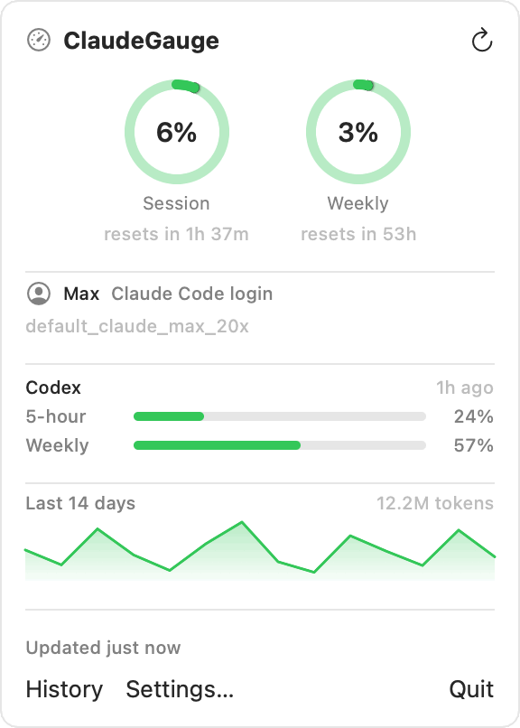
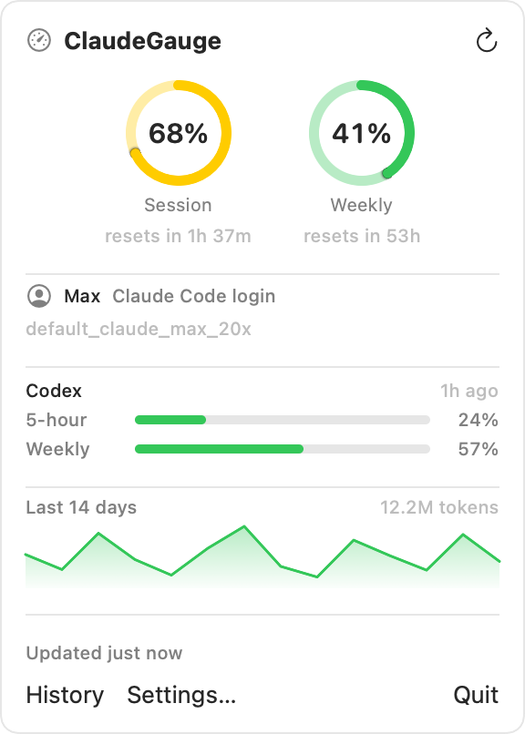
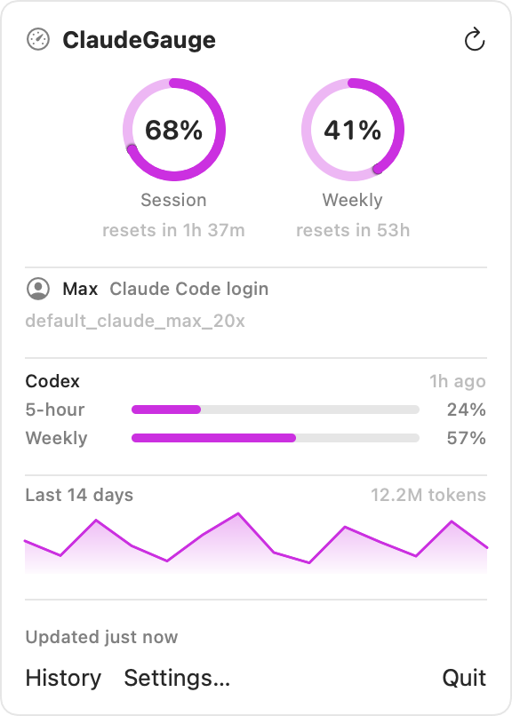
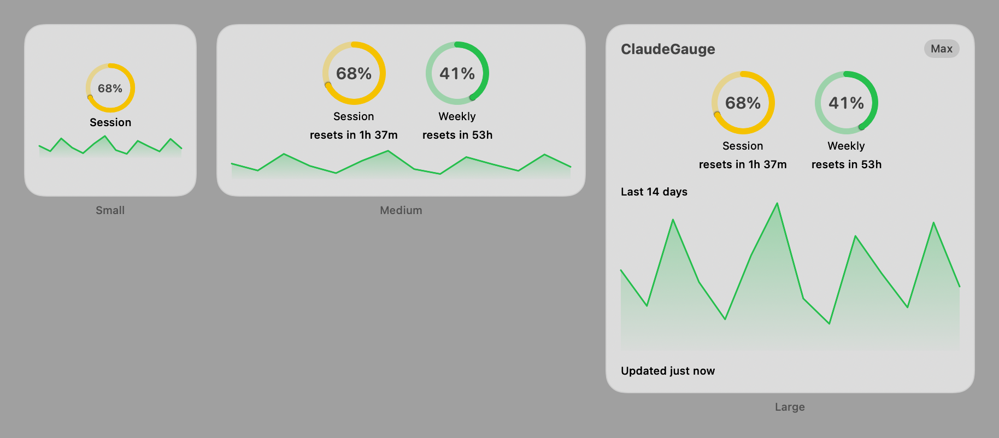
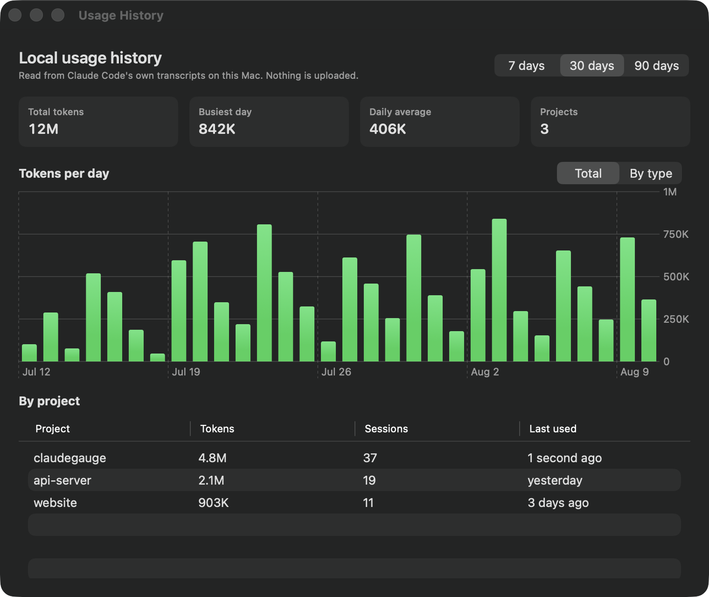
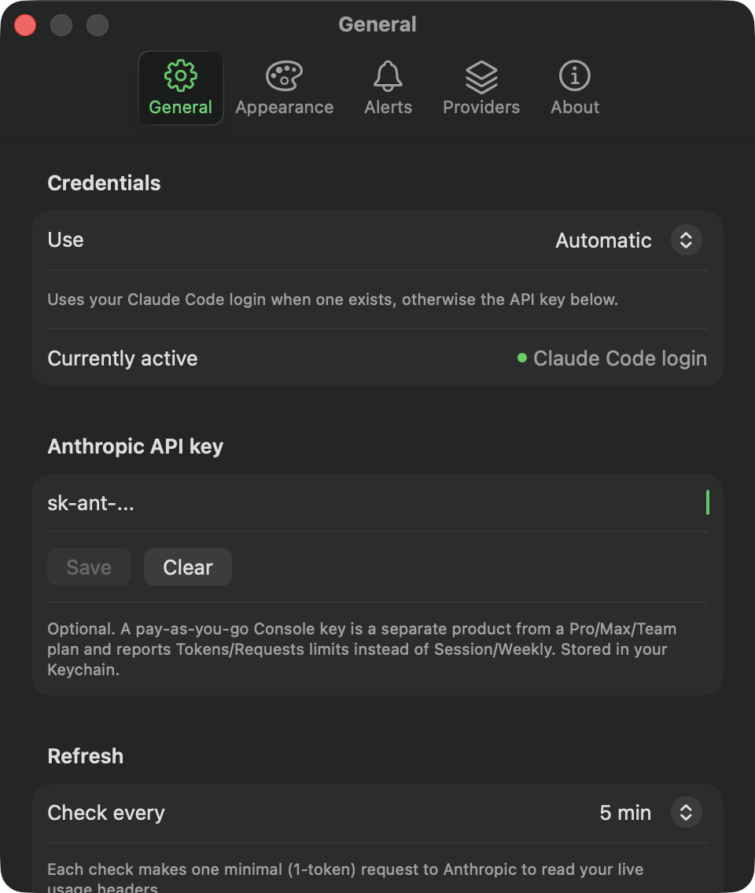

# ClaudeGauge


[](https://github.com/Bajnok11/ClaudeGauge/actions/workflows/build.yml)

**ClaudeGauge** is a native macOS app that tracks your Claude session and weekly usage limits — from the menu bar, and from an actual **WidgetKit** desktop / Notification Center widget, both driven by the same data and the same design.

> **Not affiliated with Anthropic.** ClaudeGauge is an unofficial, independent, community project. It is not affiliated with, endorsed by, or a product of Anthropic. "Claude" is a trademark of Anthropic; this project simply reads usage data that Anthropic's own API and CLI already expose to you.

<p align="center">
  
</p>

## Features

- **Menu bar tracker** — session (5-hour) and weekly usage at a glance, with four glyph styles (icon, percentage, both, or an inline bar) and your choice of which metric it tracks.
- **Real desktop widget** — small, medium, and large WidgetKit widgets you can pin to your desktop or Notification Center, each configurable independently via right-click → **Edit Widget**.
- **Usage history and charts** — daily token totals and a per-project breakdown, parsed entirely from Claude Code's own local transcripts. No network, no credentials, nothing uploaded.
- **Threshold alerts** — get notified once when you cross 80% (or whatever you pick). Each threshold re-arms only after the window rolls over, so a long session at 90% won't buzz you every few minutes.
- **Account details** — plan and rate-limit tier read straight off your existing login, so you can always see *which* account is being reported on.
- **Codex too** — optionally track OpenAI Codex CLI alongside Claude, read from its own local session logs (no API key, no network request).
- **Genuinely customizable** — accent color, warning/critical thresholds, popover layout, compact mode, refresh interval, launch at login.
- **Credential-safe by design** — reads the OAuth token Claude Code's own CLI already stores, or an API key kept in your Keychain. No browser cookie scraping, ever.

|  |  |
|---|---|
|  |  |
| The popover: live gauges, account, Codex, and a 14-day sparkline. | Accent color, thresholds, and layout are all yours. |







<sub>Screenshots show sample data — see [Regenerating the screenshots](#regenerating-the-screenshots).</sub>

## Why another Claude usage tracker?

There are already several good menu-bar apps for tracking Claude usage on macOS — projects like ClaudeBar, Claude-Usage-Tracker, ClaudeMeter, ClaudeUsageBar, Usagebar, Claude Tracker, ai-usage-widget, claude-toolbar, and others each cover this space in their own way. ClaudeGauge isn't trying to claim that space is empty. It's built around a few specific choices that, as far as we've found, none of the existing menu-bar trackers combine:

- **A real WidgetKit widget.** Almost every tracker in this space is an `NSStatusItem` menu-bar app only. ClaudeGauge ships an actual WidgetKit extension — three sizes — that lives on your desktop or in Notification Center, sharing one data snapshot and one visual component with the menu bar app.
- **No cookie scraping, no ToS risk.** Some trackers read your Claude.ai session cookies out of your browser to get usage data — a technique their own docs sometimes flag as a potential Terms of Service concern. ClaudeGauge instead reads the same OAuth token the official Claude Code CLI already stores (or a manually entered Anthropic API key as a fallback), and reads Anthropic's own official rate-limit response headers. Same signal Claude Code itself relies on — no scraping involved.
- **Local-only history, no invented costs.** The history view is built purely from your local Claude Code transcript logs — no network calls, no credentials needed for it. Deliberately, ClaudeGauge does **not** compute a USD cost estimate: other trackers have had open issues about cost numbers being wildly overstated from stale or hardcoded pricing assumptions. ClaudeGauge would rather show accurate raw token counts than a confident-looking wrong dollar figure.

If your priority is broad multi-provider coverage today (Gemini, Copilot, and friends), one of the existing tools may suit you better — ClaudeGauge ships Claude plus Codex, and the provider layer is built for more (see [ROADMAP.md](ROADMAP.md)).

## Requirements

- macOS 14 or later to run the app (Sonoma+; the Homebrew cask requires it explicitly).
- [Claude Code](https://claude.com/claude-code) installed and logged in — ClaudeGauge reads its login automatically (current Claude Code versions store it in the macOS Keychain under `"Claude Code-credentials"`; older versions' plaintext `~/.claude/.credentials.json` is used as a fallback) — **or** your own Anthropic API key entered manually in Settings.
- To build from source: Xcode 16 or later (developed on Xcode 26.6), and [XcodeGen](https://github.com/yonaskolb/XcodeGen) (`brew install xcodegen`).

## Installing

### Homebrew (recommended)

```bash
brew tap Bajnok11/claudegauge
brew install --cask claudegauge
```

### Manually, from a DMG

Download the latest `.dmg` from [Releases](https://github.com/Bajnok11/ClaudeGauge/releases), open it, and drag ClaudeGauge into Applications.

### ⚠️ About the Gatekeeper warning

ClaudeGauge doesn't have a paid Apple Developer Program membership yet (see [Build & signing status](#build--signing-status)), so these builds are signed with a free/personal Apple ID team only — not notarized. **macOS Gatekeeper will reject the app outright on first launch**, not just show a soft "unidentified developer" warning. The Homebrew cask handles this for you automatically (its `postflight` step removes the quarantine flag after install). If you used the manual DMG instead, try opening the app once (it'll be blocked), then go to **System Settings → Privacy & Security**, scroll down, and click **Open Anyway** — or from Terminal: `xattr -d com.apple.quarantine /Applications/ClaudeGauge.app`.

## Setting it up

On first launch ClaudeGauge looks for a Claude Code login automatically — if you use the `claude` CLI, there's usually nothing to configure.

If it says no credentials were found, **Settings → General** gives you an explicit choice of source:

| Source | What it does |
|---|---|
| **Automatic** (default) | Claude Code login when one exists and is valid, otherwise your API key. |
| **Claude Code login** | Only the CLI login. Errors rather than silently falling back. |
| **API key** | Only your saved key, even when you're signed in to Claude Code. |

A couple of things worth knowing:

- **If your Claude Code login has expired**, ClaudeGauge detects it from the stored token's own expiry and says so, rather than spending a doomed request. Run `claude` in Terminal to sign in again. In **Automatic** mode it will fall back to your API key if you have one saved.
- **A pay-as-you-go Console API key is a different product** from a Claude Pro/Max/Team plan. It has no 5-hour or weekly window, so ClaudeGauge relabels the two gauges **Tokens** and **Requests** (per-minute limits) rather than mislabeling them Session/Weekly.

## How it reads your usage

The menu bar app is the only part of ClaudeGauge that ever talks to the network. On your configured timer, it resolves credentials and sends one minimal request to Anthropic's API (the cheapest possible real call). It doesn't care about the response body; it reads Anthropic's own rate-limit response headers, which report your current session and weekly utilization directly.

That reading is written to a small App Group–shared snapshot on disk, and the widget extension is told to refresh. Critically, the widget itself **never** calls the network — its WidgetKit timeline provider only ever reads the last snapshot the menu bar app already fetched. This keeps the widget inside WidgetKit's tight background-execution budget and guarantees it can never show a number the menu bar app didn't already show first. For the full technical breakdown, see [ARCHITECTURE.md](ARCHITECTURE.md).

## Privacy

Nothing leaves your device except the direct API calls ClaudeGauge itself makes to `api.anthropic.com` to check your rate-limit headers. Specifically:

- No telemetry, no analytics, no crash reporting, no third-party servers of any kind.
- No credentials are ever transmitted anywhere except directly to Anthropic's API, over HTTPS, as part of the standard request authentication.
- The history view and the Codex integration never touch the network at all — everything is read and computed on-disk, locally.
- API keys are stored in the macOS Keychain, not in plain text or `UserDefaults`.

## Building from source

```bash
git clone https://github.com/Bajnok11/ClaudeGauge.git
cd ClaudeGauge

# The .xcodeproj is generated from project.yml and isn't committed
xcodegen generate
open ClaudeGauge.xcodeproj
```

In Xcode, select your own Team under **Signing & Capabilities** for both the `ClaudeGauge` and `ClaudeGaugeWidget` targets, then hit **Run**.

Other useful commands:

```bash
cd ClaudeGaugeCore && swift test   # core logic tests — no Xcode, no network
./Scripts/build-dmg.sh             # build a distributable DMG
./Scripts/generate-icon.swift      # regenerate the app icon
./Scripts/render-screenshots.sh    # regenerate the images in this README
```

### Regenerating the screenshots

`./Scripts/render-screenshots.sh` produces every image above. The popover, widgets, and GIF are drawn offscreen with `ImageRenderer` (a menu bar popover has no window to capture); History and Settings are captured as real windows, since they use AppKit-backed SwiftUI that `ImageRenderer` can't draw. Everything runs against fixed sample data — so regenerating them never publishes your own project names or usage, and the images don't churn in git.

### Build & signing status

ClaudeGauge builds and runs today via a free/personal Apple ID team. Because there's no paid Apple Developer Program account behind this project yet, there is **no notarized build** — the DMG and Homebrew cask above exist and work (see the Gatekeeper note above), but there's still no Developer ID signature and nothing on the Mac App Store. See [DISTRIBUTION.md](DISTRIBUTION.md) for the exact steps planned for once a paid account is in place.

## Roadmap

Highlights only — full detail and rationale in [ROADMAP.md](ROADMAP.md):

- **iOS companion app + Live Activity** — macOS has no Live Activity equivalent, so this is planned as a separate iOS app.
- **More providers** — Gemini CLI and Copilot need their local quota formats verified first-hand; Claude and Codex ship today.
- **Cost estimation** — only once there's a pricing source reliable enough to keep current.
- **Notarized, Developer ID–signed distribution** — blocked on a paid Apple Developer account.

## Contributing

Contributions are welcome — see [CONTRIBUTING.md](CONTRIBUTING.md) for dev setup, project structure, and code style conventions. Standard GitHub flow: fork, branch, PR. No CLA required.

## License

MIT — see [LICENSE](LICENSE) for the full text.
